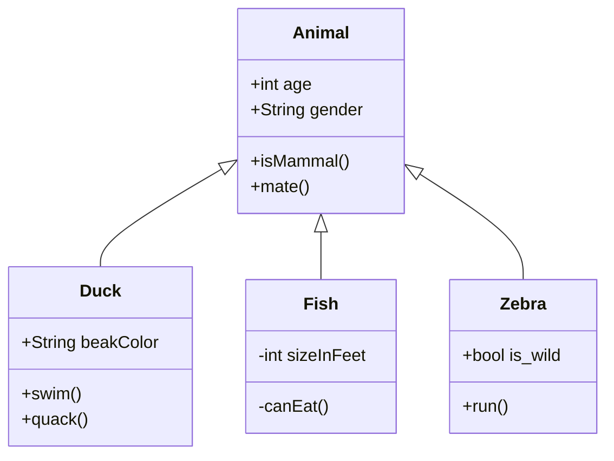

# POO
La **POO** es un paradigma que se utiliza fundamentalmente para brindar soluciones. Es una forma de programar cuya idea principal es emular el mundo real a través de los objetos. 
> "Un objeto en POO representa alguna entidad de la vida real, es decir, alguno de los objetos que pertenecen al negocio con que estamos trabajando o al problema con el que nos estamos enfrentando, y con los que podemos interactuar.."
> [Wikipedia](https://es.wikipedia.org/wiki/Objeto_(programaci%C3%B3n).
> Los objetos teiene dos principales: 
  - *Un estado* que obedece a unas características como: nombre, raza y color.
  - *Un comportamiento* como: ladrar, comer, dormir.

## Elementos básicos del POO:

1. *Clases:*  Se utilizan para representar las entidades o conceptos como los sustantivos en el lenguaje. Cada Clase es un conjunto de variables y metodos para operar con dichos datos _el comportamiento_.
> Una clase agrupa Estado (atibutos) y comportamientos(métodos) de los objetos.

2. *Métodos:* Es una subrutina o serie de sentencias para llevar a cabo una acción que retorna una salida o valor.

```java
public class Animal
{
    private String raza;
    private String nombre;
    private int edad;

    public Animal(String nuevoNombre)
    {
        nombre = nuevoNombre; //Se le da un nombre al animal
    }

    //Método para obtener la edad del animal
    public int getEdad()
    {
        return edad;
    }

    //Método para establecer la edad del animal
    public void setEdad(int nuevaEdad)
    {
        edad = nuevaEdad;
    }

    //Método para obtener el nombre del animal
    public String getNombre()
    {
        return nombre;
    }
}
```

3. *Herencia:* es un mecanismo que permite reutilizar o extender comportamientos definidos en otras clases compartiendo métodos y datos.

 - Superclases y Subclases
 
El concepto de herencia conduce a una estructura jerárquica o estructura de árbol, esto significa que las realciones de clases deben ajustarse a dicha estructura. Cada Calse tiene una clase padre y son conocidas como *superclases* y las clases hijas se les denomina *subclases*.
> las _superclase_ pueden tener un sinnúmero de subclases.
> 
> Una _subclase_ solo puede tener una superclase.



4. *Objetos* : como se explicó al inicio de este artículo, los objetos tienen un *estado* determinado por una o más varialbles y un *comportamiento* que obedece a los métodos. El comportamiento es publico y el estado es privado.

```java
public class Aclaracion
{
    private int atributo1;
    private int atributo2;
    private String atributo3;

    //Declaramos un constructor
    public Aclaracion(int attr1, int attr2, String attr3)
    {
        atributo1 = attr1;
        atributo2 = attr2;
        atributo3 = attr3;
    }

    public static void main(String[] args)
    {
        Aclaracion ac = new Aclaracion(5, 10, "x");//Creamos un objeto enviando parámetros al constructor

        System.out.println(ac.atributo1 + ", " + ac.atributo2 + ", " +ac.atributo3);//Mostramos el valor de los atributos
        //Imprime '5, 10, x'
    }
}
```

5. *Eventos:* son acciones que se generan en aplicaciones gráficas ocasionados por los usuarios al oprimir un botón, cambiar el color del texto o dar clic en un texto.


*Tipos de eventos:*

- ActionEvent : generado por activación de componentes
- AdjustmentEvent : generado por  ajuste de  componentes  ajustables como  barras de desplazamiento
- ContainerEvent :  generado  cuando los  componentes  se  agregan  o se quitan  de un contenedor
- FocusEvent : generado cuando un componente entra o sale del foco
- ItemEvent : generado  cuando un artículo  se  selecciona  de una lista,  opción, o caja de  chequeo
- KeyEvent : generado por actividad del teclado
- MouseEvent : generado por actividad del ratón
- PaintEvent : generado cuando un componente se pinta
- TextEvent : generado cuando un componente del texto se modifica
- WindowEvent : generado por actividad de la ventana (como cerrar, abrir, minimizar)
<https://victomanolo.wordpress.com/eventos-en-java/>

6. *Atributos:* Son aquellos que son visibles y que reflejan características como el tamaño, color forma o posición. Los atributos estan asociados a las instancias de la clase, aunque existen otros atributos que no estan asociados a las instancias , sino a las clases.

Los atributos deberian ser públicos para ser utilizados desde fuera de la clase como son el atributi PI.

```java 
public class Persona{
                                              
          public int altura;

                               }
 // El atributo altura es de instancia porque pertenece a cada persona:
               
    Persona mario = new Persona();
    mario.altura = 184;
    Persona maria = new Persona();
    maria.altura = 152;
                       
   }
   
    public class Persona{
                              
               public static int cantidadDeOjos = 2;

                               }

 // l atributo cantidadDeOjos en la clase Persona es de clase, debido a que todas las instancias de la clase persona tendrán igual cantidad de ojos.


     Persona mario = new Persona();
     Persona maria = new Persona ();
     mario.cantidadDeOjos                 // es igual a 2
     maria.cantidadDeOjos                // es igual a 2
     Persona.cantidadDeOjos             // es igual a 2    
     
     
     }      
  ```
  
  7. *Abstración:* es la característica específica de un objeto y que lo diferencia de los demás

 ```java
 
class Estudiante
{
  protected nombre;
  protected email;
}
// cada estudiante tiene un mombre y email que lo diferencia de otros estudiantea

```

8. *Encapsulamiento:* hace referencia a limitar el acceso en las variables de la clase. Generamente se ulitilizan lo metodos set y get o modificadores de acceso:

- *privated*, corresponde al nivel cerrado de acceso.
- *protected* corresponde al nivel protegido.
- *public* corresponde al nivel abierto.


 ```java
public class Animal
{
// modificador de acceso de nivel cerrado 
    private String raza;
    private String nombre;
    private int edad;

    public Animal(String nuevoNombre)
    {
        nombre = nuevoNombre; //Se le da un nombre al animal
    }

    //Método get para obtener la edad del animal sin que esta pueda ser modificada por el usuario 
    public int getEdad()
    {
        return edad;
    }

    //Método set para cambiar la edad del animal
    public void setEdad(int nuevaEdad)
    {
        edad = nuevaEdad;
    }

    //Método para obtener el nombre del animal
    public String getNombre()
    {
        return nombre;
    }
}

 ```
 
 9. *Polimorfismo: es la capacidad que tienen los objetos de ofrecer distintas respuestas en función de los parámetros.

 ```java
// superclase 
class Animal {
  public void makeSound() {
    System.out.println("Grr...");
  }
}
// Subclase 
class Cat extends Animal {    //Hace referencia al objeto gato
  public void makeSound() {
    System.out.println("Meow");
  }                              
}                          
class Dog extends Animal {   //Hace referencia al objeto perro
  public void makeSound() {
    System.out.println("Woof");
  }
}
//podemos llamar a los métodos makeSound().
a.makeSound();
//Outputs "Woof"

b.makeSound();
//Outputs "Meow"

 ```
 Por lo general diremos que existen 3 tipos de polimorfismo:

- Sobrecarga: aplica cuando existen funciones con el mismo nombre en clases que son completamente independientes.
- Paramétrico: Existen funciones con el mismo nombre pero se usan diferentes parámetros (nombre o tipo).
- Inclusión: Es cuando se puede llamar a un método sin tener que conocer su tipo, así no se toma en cuenta los detalles de las clases especializadas.
